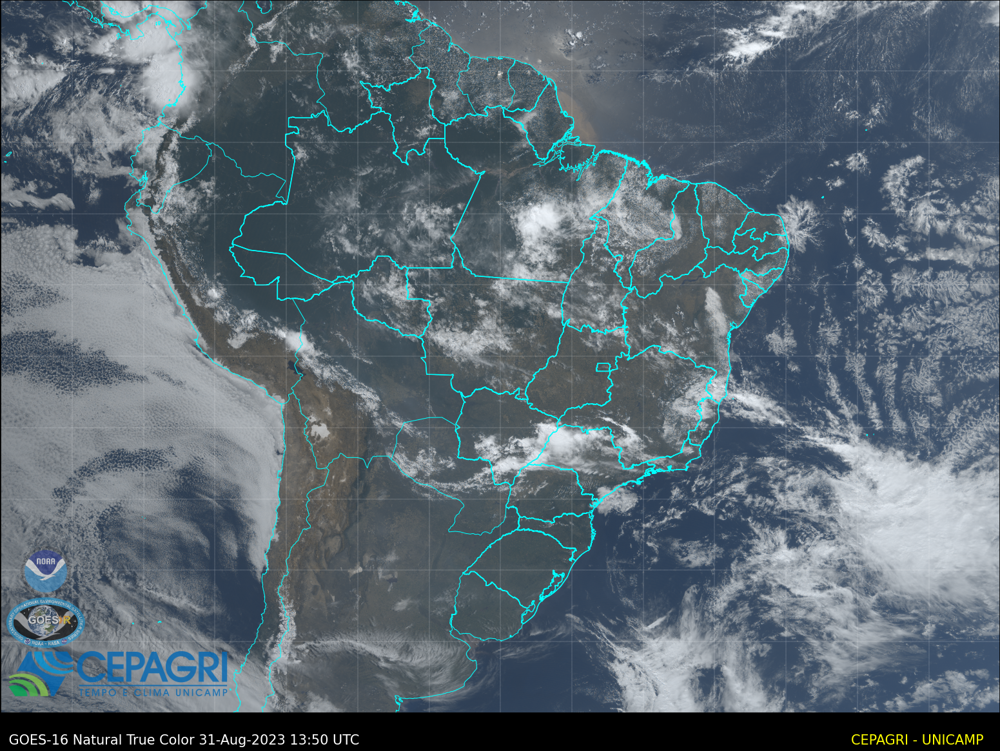

# NOAA GOES 16 on CEPAGRI 

The National Oceanic and Atmospheric Administration (NOAA) operates a constellation of Geostationary Operational Environmental Satellites (GOES) to provide continuous weather imagery and monitoring of meteorological and space environment data for the protection of life e outros fins. GOES satellites provide critical atmospheric, oceanic, climatic and space weather products supporting weather forecasting and warnings, climatologic analysis and prediction, ecosystems management, safe and efficient public and private transportation, and other.

The satellites provide advanced imaging with increased spatial resolution, 16 spectral channels, and up to 1 minute scan frequency for more accurate forecasts and timely warnings.

The real-time feed and full historical archive of original resolution Advanced Baseline Imager (ABI) radiance data (Level 1b) and full resolution Cloud and Moisture Imager (CMI) products (Level 2) are freely available on cpa.unicamp.br.


## About the Data
All data files from GOES-16 are provided in netCDF4 format. The GOES-16 data is hosted in the `noaa-goes16`.

`<Product>/<Year>/<Day of Year>/<Hour>/<Filename>`

where:

- `<Product>` is the product generated from CEPAGRI

  - ABI-L1b-RadF - Advanced Baseline Imager Level 1b Full Disk
  - ABI-L2-CMIPF - Advanced Baseline Imager Level 2 Cloud and Moisture Imagery Full Disk
  - ABI-L2-FDCF  - Advanced Baseline Imager Level 2 Fire (Hot Spot Characterization) Full Disk
  - ABI-L2-NDVI  - Normalized difference vegetation index
  - ABI-L2-TC    - Natural True Color Level 2 (Band 01, Band 02, Band 03)
  - ABI-L2-RRQPEF - Advanced Baseline Imager Level 2 Rainfall Rate (Quantitative Precipitation Estimate) Full Disk
  - GLM-L2-LCFA - Geostationary Lightning Mapper Level 2 Lightning Detection 
  
- `<Year>` is the year the netCDF4 file was created
- `<Day of Year>` is the numerical day of the year (1-365) julian day
- `<Hour>` is the hour the data observation was made
- `<Filename>` is the name of the file containing the data. These are compressed and encapsulated using the netCDF4 standard.

A `<Filename>` is delineated by underscores '_' and looks like this:

`OR_ABI-L1b-RadF-M3C02_G16_s20231671145342_e20231671156109_c20231671156144.nc`

where:

- `OR`: Operational system real-time data
- `ABI-L1b-RadF-M3C02` is delineated by hyphen '-':
  - `ABI`: is ABI Sensor
  - `L1b`: is processing level, L1b data or L2
  - `Rad`: is radiances. Other products include CMIP (Cloud and Moisture Imagery products) and MCMIP (multichannel CMIP).
  - `F`: is full disk (normally every 15 minutes), C is continental U.S. (normally every 5 minutes), M1 and M2 is Mesoscale region 1 and region 2 (usually every minute each)
  - `M3`: is mode 3 (scan operation), M4 is mode 4 (only full disk scans every five minutes – no mesoscale or CONUS)
  - `C02`: is channel or band 02, There will be sixteen bands, 01-16
- `G16`: is satellite id for GOES-16 (future G17)
- `s20231671145342`: is start of scan time
  - 4 digit year
  - 3 digit day of year
  - 2 digit hour
  - 2 digit minute
  - 2 digit second
  - 1 digit tenth of second
- `e20231671156109`: is end of scan time
- `c20231671156144`: is netCDF4 file creation time
- `.nc` is netCDF file extension

<br>
<br>

# GOES-16 NetCDF Image Manipulation

This repository contains a Python script for manipulating images from the GOES-16 satellite in NetCDF format. 
The script processes these NetCDF to generate images, GIFs and other products.

<br>
<br>


## Table of Contents

- [Prerequisites](#prerequisites)
- [Installation](#installation)
- [Configuration](#configuration)
- [Usage](#usage)
- [About code](#About-code)
- [Processamento.py](#processamento.py)
- [License](#license)

<br>
<br>

## Prerequisites

Before using the script, make sure you have the following packages and tools installed:

- [Miniconda](https://docs.conda.io/en/latest/miniconda.html)

In linux
You can create a Conda environment with required packages using the following command:

```bash
conda create --name goes -c conda-forge matplotlib netcdf4 cartopy boto3 gdal scipy pandas scp pyspectral pyorbital pillow
```


To activate this environment, use
```bash
conda activate goes
```
To deactivate an active environment, use
```bash
conda deactivate
```
<br>
<br>


## Installation

1. Clone this repository to your local machine:

```bash
https://github.com/guimouraO1/processamentopy.git
```

2. Navigate to the project directory:

```bash
cd your-repo
```


<br>
<br>

## Configuration

You can configure the script behavior by modifying the variables in the `dirs.py` script:

```python
dirs.py
```

```python
dir_main = '/your-repo/your-repo/'
dirs = {
    'dir_in': dir_main + 'goes/',
    'dir_main': dir_main,
    'dir_out': dir_main + 'output/',
    'dir_libs': dir_main + 'libs/',
    'dir_shapefiles': dir_main + 'shapefiles/',
    'dir_colortables': dir_main + 'colortables/',
    'dir_logos': dir_main + 'logos/',
    'dir_maps': dir_main + 'maps/',
    'dir_temp': dir_main + 'temp/',
    'arq_log': dir_main + 'logs/Processamento-GOES_' + str(datetime.date.today()) + '.log'
}
```

Make sure to update the paths in the `dirs` dictionary to match your file system structure and requirements.

<br>
<br>

## Usage

The directory structure of this repository is as follows:

```
.

├── colortables
├── goes
├── logos
├── logs
├── maps
├── modules/
│   ├── check_new_images.py
│   ├── dirs.py
│   ├── logs.py
│   ├── process_gif.py
│   ├── processamento.py
│   ├── quantity_products.py
│   ├── remap.py
│   ├── remove.py
│   ├── send_products.py
│   ├── utilities.py
├── output
├── shapefiles
├── temp
├── oldBands.json             
├── download_amazon.py        
├── main.py                   
├── processamento.sh          
└── README.md
```

To use the script, follow these steps:

1. Ensure you have the required NetCDF images in the input directory (`dir_in/band{1-16}`).

2. Run the script:

```bash
/opt/miniconda3/envs/goes/bin/python3 main.py
```
3. The script will process the images, generate GIFs, and perform other operations based on the configuration.


<br>
<br>


## About code

The code processes the images:

- **Bands 1-16**: This product is produced every 10 minutes and shows all 16 bands of Goes16.

- **Natural True Color**: This product is produced every 10 minutes and shows a true-color image of the Earth's surface as it would appear to the human eye.

- **AIRMASS**: This product is produced every 10 minutes and shows the distribution of atmospheric moisture and dust in the Earth's atmosphere.

- **Land Surface Temperature**: This product is produced once per hour and shows the temperature of the Earth's surface.

- **Fire Hot Spot**: This product is produced once per day and shows the location of active fires on the Earth's surface.

- **Geostationary Lightning Mapper**: This product is produced every 10 minutes and shows the total lightning activity of the western hemisphere.

- **Normalized Difference Vegetation Index**: This product is produced once per week and shows the health and density of vegetation on the Earth's surface.

- **Rainfall Rate (Quantitative Precipitation Estimate)**: This product is produced every 10 minutes and shows the rate of rainfall on the Earth's surface.

<br>

 ### Features include:
  - `dirs.py`: Defines input, output, and temporary directories.
  - `bands` dictionary: Represents the processing status of each image band.
  - `conf_log` function: Configures log generation.
  - `checar_imagens` function: Checks for new images to process.
  - `processamento_das_imagens` function: Performs image processing.
  - `remover_imagens` function: Removes processed image files from the input directory.
  - `quantity_products` function: Controls the quantity of products to retain for producing an animated GIF.
  - `process_gif` function: Creates an animated GIF from the processed images.
  - `send_products` function: Sends processed images to a specific site (cpa.unicamp.br).


## Example: NOAA GOES-16 truecolor Processing on CEPAGRI

---


---

## License
This project is licensed under the [MIT License](LICENSE).

## Acknowledgments

This script is developed as part of an image processing project for the GOES-16 satellite data. It builds upon various open-source libraries and tools.

## Author
**Author:** [Guilherme de Moura Oliveira]
**Contact:** [guimoura@unicamp.br]
**Last Updated:** [09/11/2023]
